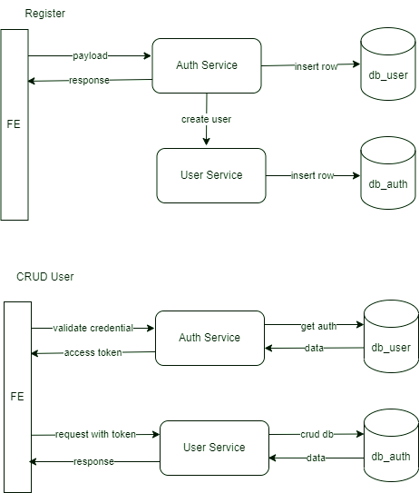
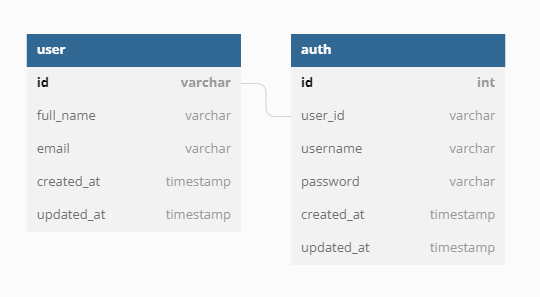

# mini-login

## _A mini user-accounts management REST API in microservices architecture_
###
The two microservices are: 
    
    1. auth-service -> login/register endpoints and get token
    2. user-service -> consists of user crud endpoints


## Service Flow



## DB Diagram




## Tech Stack

**Language:** Go

**Framework:** [Beego](https://www.beego.vip/)

**Database:** Postgresql

**ORM:** [Gorm](http://gorm.io/)


## Run Locally

Clone the project to your Go environment ($GOPATH/src)

```bash
  git clone https://github.com/kidboy-man/mini-login.git
```

Go to the project directory

```bash
  cd mini-login
```

Using Docker, to run this app do: 

```bash
  docker-compose up -d
```
This will run the mini-login with 3 containers, those are: database (for the db postgres), 
auth-service, and user-service.

Using the app:

    1. Open your browser, go to http://localhost:8081 -> Auth-Service Swagger Api,
       can do register on regiser endpoint. Choose your username and password.
    2. Do login on login endpoint using your registered. Copy the token response value.
    3. Open new tab, go to http://localhost:8080 -> User-Service Swagger Api.
       You can get your profile detail and/or do update your profile using the private endpoints.
       Paste the token in Authorization column in format `Authorization <YOUR_TOKEN>`.
    4. You can also access admin endpoints using the admin token, 
       login with userame=i_am_admin password=12345678

## API Reference
#### Auth-Service Swagger: 
http://localhost:8081/Swagger
#### User-Service Swagger: 
http://localhost:8080/Swagger

